# Лабораторная работа по прокси-серверу Squid
## 1. Установить и настроить программное обеспечение Squid на сервере
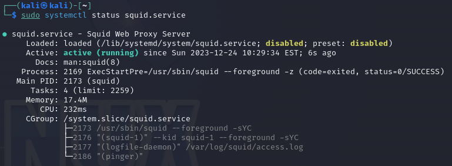
## 2. Запретить всем клиентам доступ в интернет. Разрешить доступ только с через прокси-сервер.

    acl auth proxy_auth REQUIRED # Доступ всем прошедшим авторизацию
    acl localnet src 192.168.10.0/24 # Подсеть компании
    http_access allow auth # Доступ всем прошедшим аутентификацию
    
<mark>Пример доступа с аутентификацией пункте 7</mark>

## 3. При помощи регулярных выражений запретить доступ к всем ресурсам с фильмами в переводе Goblina.

    Конфиг

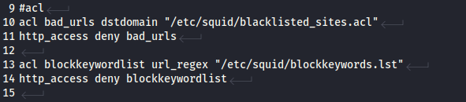

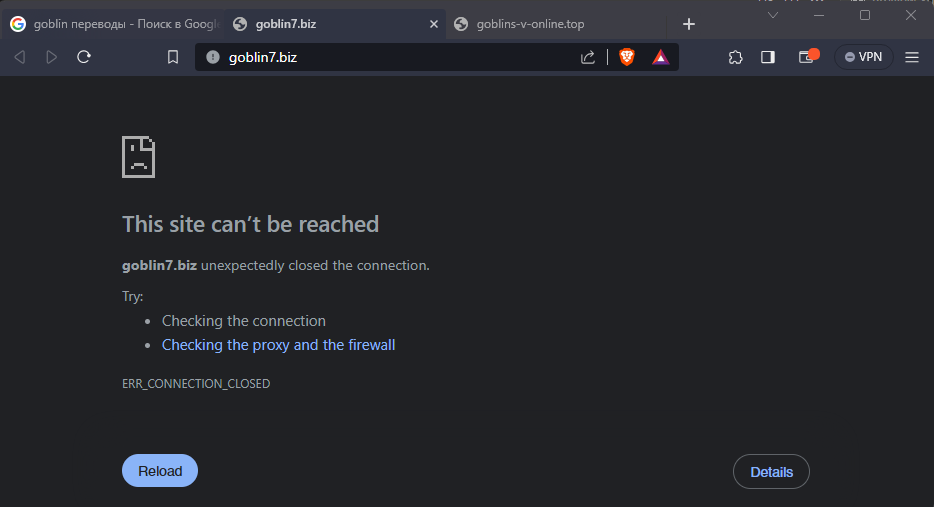

## 4. Запретить просматривать ульяновские новостные порталы ulpressa и её зеркала.

    Конфиг

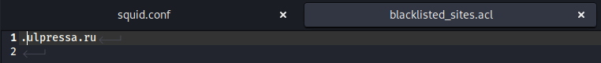

    Заблокированная ulpressa.ru

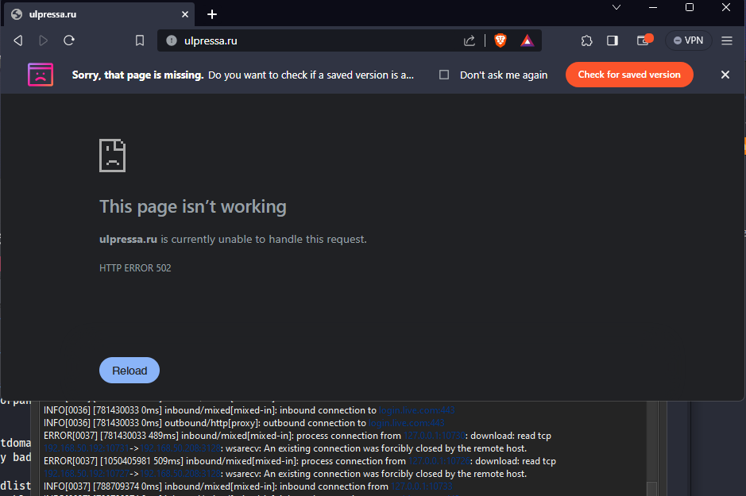

## 5. Разрешить последние два пункта с 12:00 до 12:59

    Конфиг

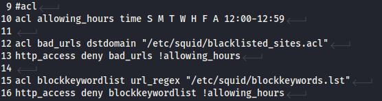

## 6. Разрешить полный доступ определённому пользователю по его IP адресу.

    Конфиг

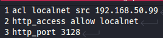

    Заблокированные пакеты

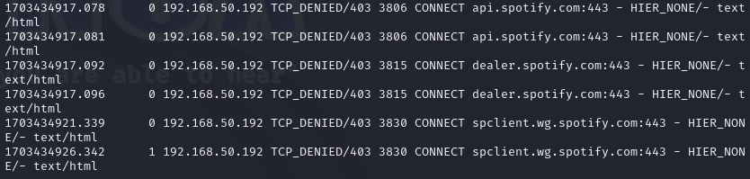

    Разрешенные пакеты

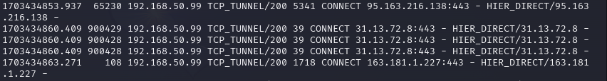

## 7. Разрешить полный доступ определённому пользователю по логину и паролю/ по его доменной учётной записи.

    Конфиг

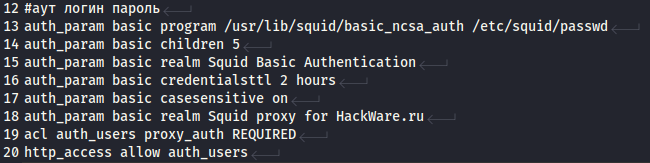

    Заблокированные пакеты

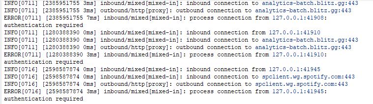

    Авторизация

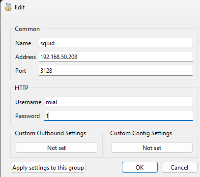

    Разрешенные пакеты

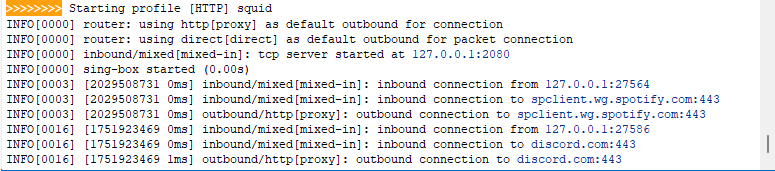

## 8. Настроить сброс кеша каждый день в 00:00

    Баш скрипт

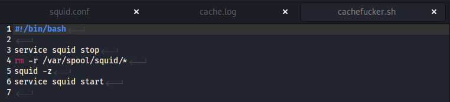

    Проверка работы

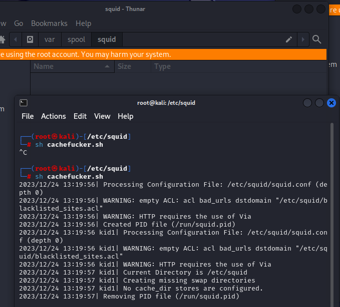

    Автозапуск в кроне

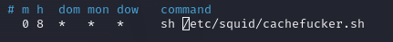

# Полный конфиг

<code>
#acl localnet src 192.168.50.99 #аут по айпи
#http_access allow localnet #аут по айпи

http_port 3128 #порт прокси
via off #игнор ограничений

#acl
acl allowing_hours time S M T W H F A 12:00-12:59

acl bad_urls dstdomain "/etc/squid/blacklisted_sites.acl"
http_access deny bad_urls !allowing_hours

acl blockkeywordlist url_regex "/etc/squid/blockkeywords.lst"
http_access deny blockkeywordlist !allowing_hours

#аут логин пароль
auth_param basic program /usr/lib/squid/basic_ncsa_auth /etc/squid/passwd
auth_param basic children 5
auth_param basic realm Squid Basic Authentication
auth_param basic credentialsttl 2 hours
auth_param basic casesensitive on
auth_param basic realm Squid proxy for HackWare.ru
acl auth_users proxy_auth REQUIRED

http_access allow auth_users

</code>
